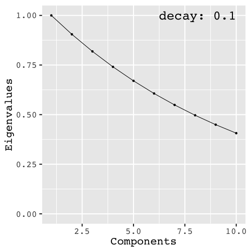

```{r setup, include=FALSE}
## Knitr Options
options(htmltools.dir.version = FALSE, digits = 3, signif = 999)
## Chunk Options
knitr::opts_chunk$set(
  echo = FALSE, comment = NULL, eval = TRUE,
  dev = 'svg', out.width='95%', fig.retina=2,
  fig.align = 'center', warning = FALSE,
  message = FALSE)
## Hightlight part of code hook
hook_source <- knitr::knit_hooks$get('source')
knitr::knit_hooks$set(source = function(x, options) {
  x <- stringr::str_replace(x, "^[[:blank:]]?([^*].+?)[[:blank:]]*#<<[[:blank:]]*$", "*\\1")
  hook_source(x, options)
})
## Source the script file for creating relevant space
source("_script/00-function.R")
source("_script/relevant-space.R")
load("_script/design.rdata")
pred_error <- readRDS("_script/prediction-error.rds")
est_error <- readRDS("_script/estimation-error.rds")
## Load packages
library(tidyverse)
library(simrel)
library(gridExtra)
library(pls)
library(ggridges)
```

class: center, middle, inverse

# A comparison of multivariate prediction methods

## Raju Rimal

### 19 June, 2019

```{r, out.width='40%'}
knitr::include_graphics("_images/NMBUwhite.svg")
```

[`https://therimalaya.github.io/SSC16`](https://therimalaya.github.io/SSC16)

---

background-image: url(_images/logo-nb.svg), url(_images/SSC16-Logo.svg)
background-size: 35% auto, 25% auto
background-position: 25% 50%, 75% 50%
background-repeat: no-repeat

---
class: center, middle, inverse

# Background
## Relevant and irrelevant space in linear model

---

class: top

.left-column[
# Linear Model

```{r, out.width='100%', dev='svg', fig.asp=0.6, fig.align='center', fig.width=5, eval = TRUE}
col_vec <- rev(RColorBrewer::brewer.pal(3, "Set1"))
rel_col <- alpha(col_vec[2], 1)
irrel_col <- alpha(col_vec[1], 0.2)
plt <- plot_model(rel_col, irrel_col, 1, 0.6)
grid.newpage()
grid.draw(grid_by_name(plt,"rect_box|labels|arrow_ann"))
```


```{r simulation-1}
set.seed(777)
sobj <- simrel(
  n      = 20,
  p      = 10,
  q      = 10,
  relpos = list(1:4),
  R2     = 0.8,
  gamma  = 0.9,
  ypos   = list(1:4),
  m      = 4,
  type   = "multivariate"
)
```


```{r, fig.width = 4, dev= 'svg', fig.asp = 1, fig.align='left', out.width = '100%'}
plot_cov(sobj, type = "relpred", ordering = FALSE, facetting = FALSE) +
  guides(fill = guide_legend(
    label = FALSE, title = element_blank(), override.aes = list(
      fill = "white", color = "white"
    )
  ))
```

]

.right-column[

### The Model:

$$\begin{bmatrix}
  y \\ \mathbf{x}
\end{bmatrix} 
\sim \mathsf{N}\left(
  \begin{bmatrix}
    \boldsymbol{\mu}_y \\
    \boldsymbol{\mu}_x
  \end{bmatrix},
  \begin{bmatrix}
    \boldsymbol{\Sigma}_{yy} & \boldsymbol{\Sigma}_{yx}\\ 
    \boldsymbol{\Sigma}_{xy} & \boldsymbol{\Sigma}_{xx}
  \end{bmatrix}
\right)$$

### Linear Regression:

$$\mathbf{y} = \boldsymbol{\mu}_y + (\mathbf{x} - \boldsymbol{\mu}_x)\boldsymbol{\beta} + \boldsymbol{\varepsilon},\; \boldsymbol{\varepsilon} \sim \mathsf{N}(0, \boldsymbol{\Sigma}_{y|x})$$

### Regression Coefficients:

$$\boldsymbol{\beta} = \boldsymbol{\Sigma}_{xx}^{-1}\boldsymbol{\Sigma}_{xy}$$

]

---

class: top

.left-column[
# Linear Model

```{r, out.width='100%', dev='svg', fig.asp=0.6, fig.align='center', fig.width=5, eval = TRUE}
col_vec <- rev(RColorBrewer::brewer.pal(3, "Set1"))
rel_col <- alpha(col_vec[2], 1)
irrel_col <- alpha(col_vec[1], 0.2)
plt <- plot_model(rel_col, irrel_col, 1, 0.6)
grid.newpage()
grid.draw(grid_by_name(plt,"rect_box|yrel_space|xrel_space|labels|in_labels|arrow_ann"))
```


```{r, fig.width = 4, dev= 'svg', fig.asp = 1, fig.align='left', out.width = '100%'}
plot_cov(sobj, type = "relpos", ordering = FALSE, facetting = FALSE)
```

].right-column[
Let us make a transformation as $\boldsymbol{z} = \mathbf{R} \boldsymbol{x}$ and $\boldsymbol{w} = \mathbf{Q} \boldsymbol{y}$ where $\mathbf{R}$ and $\mathbf{Q}$ are orthogonal matrices, i.e. $\mathbf{R}^t = \mathbf{R}^{-1}$ and $\mathbf{Q}^t = \mathbf{Q}^{-1}$

### New Model

$$\begin{bmatrix}
  \mathbf{w} \\ \mathbf{z}
\end{bmatrix} 
\sim \mathsf{N}\left(
  \begin{bmatrix}
    \boldsymbol{\mu}_w \\
    \boldsymbol{\mu}_z
  \end{bmatrix},
  \begin{bmatrix}
    \boldsymbol{\Sigma}_{ww} & \boldsymbol{\Sigma}_{wz}\\ 
    \boldsymbol{\Sigma}_{zw} & \boldsymbol{\Sigma}_{zz}
  \end{bmatrix}
\right) = 
\mathsf{N}\left(
  \begin{bmatrix}
    \mu_y \\
    \boldsymbol{\mu}_z
  \end{bmatrix},
  \begin{bmatrix}
     \mathbf{Q}\boldsymbol{\Sigma}_{yy} \mathbf{Q}^t &  
     \mathbf{Q}\boldsymbol{\Sigma}_{yx} \mathbf{R}^t\\ 
    \mathbf{R}\boldsymbol{\sigma}_{xy} \mathbf{Q}^t & 
    \mathbf{R}\boldsymbol{\Sigma}_{xx} \mathbf{R}^t
  \end{bmatrix}
\right)$$

### Linear Regression
$$\mathbf{w} = \boldsymbol{\mu}_w + \boldsymbol{\alpha}^t(\mathbf{z} - \boldsymbol{\mu}_z) + \boldsymbol{\epsilon},\; \boldsymbol{\epsilon} \sim \mathsf{N}(0, \boldsymbol{\tau}^2)$$

### Regression Coefficients
$$\boldsymbol{\alpha} = \mathbf{Q} \boldsymbol{\beta} \mathbf{R}^t = \boldsymbol{\Sigma}_{zz}^{-1}\boldsymbol{\Sigma}_{zw} = \left[\mathbf{R}\boldsymbol{\Sigma}_{xx}\mathbf{R}^t\right]^{-1}\mathbf{R}\boldsymbol{\Sigma}_{xy}\mathbf{Q}^t$$

]


---
class: top

.left-40-column[
# Methods
## Principal Component Regression

.left-bottom-fig[

```{r, out.width='100%', dev='svg', fig.asp=0.6, fig.width=5, fig.pos='b'}
col_vec <- rev(RColorBrewer::brewer.pal(3, "Set1"))
rel_col <- alpha(col_vec[2], 1)
irrel_col <- alpha(col_vec[1], 0.2)
plt <- plot_model(rel_col, irrel_col, 1, 0.6)
grid.newpage()
grid.draw(grid_by_name(plt,"rect_box|labels"))
```

]
]
.right-60-column[

### Overview
- With each components, it captures the maximum variation in $\mathbf{x}$
- Mostly, hight variation in $\mathbf{x}$ captures its relation with $\mathbf{y}$ but not always
- The variation explained by one components is removed before going for next component

]


---
class: top

.left-40-column[
# Methods
## Principal Component Regression
## Partial Least Squares

.left-bottom-fig[

```{r, out.width='100%', dev='svg', fig.asp=0.6, fig.width=5, fig.pos='b'}
col_vec <- rev(RColorBrewer::brewer.pal(3, "Set1"))
rel_col <- alpha(col_vec[2], 1)
irrel_col <- alpha(col_vec[1], 0.2)
plt <- plot_model(rel_col, irrel_col, 1, 0.6)
grid.newpage()
grid.draw(grid_by_name(plt,"rect_box|labels"))
```

]
]
.right-60-column[

### Overview
- With each components, it captures the maximum covariance of $\mathbf{x}$ and $\mathbf{y}$
- Since it goes straight for covariance, it requires less number of components than PCR
- The variation explained by one components is removed before going for next component

### PLS1 vs PLS2
- In PLS1, each response variable is modelled separately. Here the correlation structure of $\mathbf{y}$ is not modelled neither directly or indirectly
- In PLS2, all response variables are modelled together.

]

---
class: top

.left-40-column[
# Methods
## Principal Component Regression
## Partial Least Squares
## Envelope

.left-bottom-fig[

```{r, out.width='100%', dev='svg', fig.asp=0.6, fig.width=5, fig.pos='b'}
col_vec <- rev(RColorBrewer::brewer.pal(3, "Set1"))
rel_col <- alpha(col_vec[2], 1)
irrel_col <- alpha(col_vec[1], 0.2)
plt <- plot_model(rel_col, irrel_col, 1, 0.6)
grid.newpage()
grid.draw(grid_by_name(plt,"rect_box|labels"))
```

]
]
.right-60-column[

### Overview
- Envelope is the smallest subspace where the span of $\boldsymbol{\beta}$ lies, i.e. $\varepsilon \in \text{span}(\boldsymbol{\beta})$
- It starts with separating the covariance structure into relevant (material) and irrelevant (immaterial) parts through parameterization of a linear model

### Envelope in Predictor Space
- Identifies envelope throught the reduction of predictor space

### Simulteneous Envelope
- Identifies envelope throught the reduction of both response and predictor space

]

---
class: center, middle, inverse

# Simulation and Comparison

---

class: top

.left-column[
# Simulation
## Experimental Design




]

.right-column[

```{r design-plot, echo = FALSE, fig.asp=0.4, fig.width=8, out.width='100%'}
design_chr %>%
    mutate(Design = row_number()) %>%
    ggplot(aes(eta, gamma)) +
    geom_point(shape=4) +
    ggrepel::geom_text_repel(
      aes(label = Design),
      nudge_x = 0.03, family = 'mono', fontface = "bold") +
    facet_grid(p ~ relpos, labeller=label_both) +
  scale_y_reverse(breaks = opts$gamma) +
    scale_x_continuous(breaks = opts$eta) +
    theme_minimal(base_size = 16, base_family = "mono") +
    theme(panel.grid.minor = element_blank(), text = element_text(face = "bold")) +
    coord_fixed(ratio=0.5)
```
```{r cov-plot-prep}
selected_designs <- design %>%
  mutate(Design = row_number()) %>%
  filter(p == 20, eta == 0)
sobj_list <- lapply(1:nrow(selected_designs), function(i){
  set.seed(2019)
  selected_designs %>% select(-Design) %>% get_design(i) %>% simulate()
})
names(sobj_list) <- paste0("Design", selected_designs$Design)
sigma_zy_pop <- map_df(sobj_list, function(obj){
  obj %>%
    cov_mat(which = "zy", use_population = TRUE) %>%
    tidy_sigma() %>%
    abs_sigma()
}, .id = "Design")
sigma_zy_samp <- map_df(sobj_list, function(obj){
  obj %>%
    cov_mat(which = "zy", use_population = FALSE) %>%
    tidy_sigma() %>%
    abs_sigma()
}, .id = "Design")
sigma_zy <- bind_rows(
  Population = sigma_zy_pop,
  Sample = sigma_zy_samp,
  .id = "Type"
)
lambda_df <- bind_rows(
  Population = map_df(sobj_list, tidy_lambda, use_population = TRUE, .id = "Design"),
  Sample = map_df(sobj_list, tidy_lambda, use_population = FALSE, .id = "Design"),
  .id = "Type"
)
design_chr_selected <- selected_designs %>%
    select(relpos, gamma, Design) %>%
    modify_at("relpos", paste0) %>%
    mutate_at("relpos", ~gsub("list\\(c\\((.+)\\))", "\\1", ..1))
design_name <- paste0("Design", selected_designs$Design)
design_lbl <- with(design_chr_selected, {
  paste(design_name, map2_chr(relpos, gamma, paste, sep = " | "), sep = "\n")
})
names(design_lbl) <- design_name
```
```{r cov-plot-pop, fig.pos = "H", fig.asp=0.5, fig.width=7, out.width='100%'}
sigma_zy %>% 
  filter(Type == "Population") %>% 
  ggplot(aes(Predictor, Covariance, color = factor(Response))) +
  geom_bar(data = lambda_df %>% filter(Type == "Population"), 
           aes(x = Predictor, y = lambda),
           fill = "lightgrey",
           stat = "identity", inherit.aes = FALSE) +
  geom_point(size = rel(0.8)) +
  geom_line(size = rel(0.5)) +
  facet_grid(cols = vars(Design), rows = vars(Type),
             labeller = labeller(Design = design_lbl )) +
  theme(legend.position = "bottom") +
  labs(x = "Components",
       y = "Absolute Covariances",
       color = "Response Variable",
       title = "Covariance between Predictor Components and Responses",
       subtitle = "High/Low Multicollinearity with near/far relevant predictors") +
  scale_color_brewer(palette = "Set1")
```

]

---

class: top

.left-column[
# Simulation
## Experimental Design


]

.right-column[

```{r design-plot, echo = FALSE, fig.asp=0.4, fig.width=8, out.width='100%'}
```

```{r cov-plot-samp, fig.pos = "H", fig.asp=0.5, fig.width=7, out.width='100%'}
sigma_zy %>% 
  filter(Type == "Sample") %>% 
  ggplot(aes(Predictor, Covariance, color = factor(Response))) +
  geom_bar(data = lambda_df %>% filter(Type == "Sample"), 
           aes(x = Predictor, y = lambda),
           fill = "lightgrey",
           stat = "identity", inherit.aes = FALSE) +
  geom_point(size = rel(0.8)) +
  geom_line(size = rel(0.5)) +
  facet_grid(cols = vars(Design), rows = vars(Type),
             labeller = labeller(Design = design_lbl )) +
  theme(legend.position = "bottom") +
  labs(x = "Components",
       y = "Absolute Covariances",
       color = "Response Variable",
       title = "Covariance between Predictor Components and Responses",
       subtitle = "High/Low Multicollinearity with near/far relevant predictors") +
  scale_color_brewer(palette = "Set1")
```

]

---
class: top
exclude: true

.left-column[
# Basis of Comparison
## Error Analysis
]
.right-column[
## Prediction Error
$$\mathcal{PE} = \frac{1}{\sigma^2_{y_i|x}}\mathsf{E}\left[
\left(\beta - \hat{\beta}\right)^t\Sigma_{xx}\left(\beta - \hat{\beta}\right)
\right]$$

## Estimation Error
$$\mathcal{EE} = \frac{1}{\sigma^2_{y_i}}\mathsf{E}\left[
\left(\beta - \hat{\beta}\right)^t\left(\beta - \hat{\beta}\right)
\right]$$

]

---
class: top
exclude: true

.left-column[
# Basis of Comparison
## Component Analysis
]
.right-column[
## Component used to obtain minimum prediction error
$$\mathcal{nc_\circ(\mathcal{PE})} = \underset{nc}{\mathrm{argmin}}\left(\mathcal{PE}_{nc}\right)$$

## Component used to obtain minimum estimation error
$$\mathcal{nc_\circ(\mathcal{EE})} = \underset{nc}{\mathrm{argmin}}\left(\mathcal{EE}_{nc}\right)$$

]

---
class: center, middle, inverse

# Analysis and Results

```{r pred}
pred_dta <- design_chr %>%
  select_if(function(x) n_distinct(x) > 1) %>%
  mutate(Design = as.character(1:n())) %>%
  mutate_at(vars(p, gamma, relpos, eta), as.factor) %>%
  right_join(pred_error, by = "Design") %>%
  mutate_if(is.character, as.factor) %>%
  mutate_at("p", as.factor) %>%
  mutate(Response = paste0("Y", Response))
pred_spread_df <- pred_dta %>%
  as.data.frame() %>%
  select(-Design, -q) %>%
  spread(Response, Pred_Error)
min_comp_stk <- pred_dta %>%
  group_by(p, relpos, eta, gamma, Method, Tuning_Param, Response) %>%
  summarize(Pred_Error = mean(Pred_Error)) %>%
  group_by(p, relpos, eta, gamma, Method, Response) %>%
  summarize(Tuning_Param = Tuning_Param[which.min(Pred_Error)])
pred_min <- pred_dta %>%
  select(-Design, -q) %>%
  semi_join(min_comp_stk, by = c(
    "p", "relpos", "eta", "gamma", "Method",
    "Tuning_Param", "Response"
  )) %>% select(-Tuning_Param) %>%
  spread(Response, Pred_Error)
comp_min_pred <- pred_dta %>%
  group_by(p, relpos, eta, gamma, Method, Replication, Response) %>%
  summarize(Tuning_Param = Tuning_Param[which.min(Pred_Error)]) %>%
  spread(Response, Tuning_Param)
```

```{r pred-mdl}
pred_mdl <- lm(
  formula = cbind(Y1, Y2, Y3, Y4) ~ (p + gamma + eta + relpos + Method) ^ 3,
  data = pred_min)
comp_mdl_pred <- lm(
  formula = cbind(Y1, Y2, Y3, Y4) ~ (p + gamma + eta + relpos + Method) ^ 3,
  data = comp_min_pred)
pred_aov <- anova(pred_mdl) %>%
  as_tibble(rownames = "Factors")
comp_aov_pred <- anova(comp_mdl_pred) %>%
  as_tibble(rownames = "Factors")
aov_df_pred <- bind_rows(list(Pred = pred_aov, Comp = comp_aov_pred), .id = "Type")
```

---
class: top, data

.left-40-column[
# Data for Analysis
## Error Model

```{r data-design-tbl, fig.asp=1.2}
source("_script/data-design.R")
data_design_tbl
```


].right-60-column[

```{r pca}
pred_pca <- with(pred_min, prcomp(cbind(Y1, Y2, Y3, Y4)))
expl_var <- explvar(pred_pca) %>% round(2)
pred_dta_with_pc <- bind_cols(pred_min, as.data.frame(scores(pred_pca)[]))
comp_pca_pred <- with(comp_min_pred, prcomp(cbind(Y1, Y2, Y3, Y4)))
comp_expl_var <- explvar(comp_pca_pred) %>% round(2)
comp_dta_with_pc <- bind_cols(comp_min_pred, as.data.frame(scores(comp_pca_pred)[]))
```

```{r, message=FALSE, warning=FALSE}
pc_density_plot(pred_dta_with_pc, expl_var,
                title = "Density of PCA scores for error model")
```

$$\mathtt{Pred.Error} \sim \left(\mathtt{p} + \mathtt{relpos} + \mathtt{gamma} + \mathtt{eta} + \mathtt{Methods}\right)^3$$

]


---
class: top, data

.left-40-column[
# Data for Analysis
## Component Model

```{r data-design-tbl, fig.asp=1.2}
```


].right-60-column[

```{r, message=FALSE, warning=FALSE}
pc_density_plot(comp_dta_with_pc, comp_expl_var,
                title = "Density of PCA scores for component model")
```

$$\mathtt{Min.Components} \sim \left(\mathtt{p} + \mathtt{relpos} +
  \mathtt{gamma} + \mathtt{eta} + \mathtt{Methods}\right)^3$$

]


---
class: top

.left-40-column[
# Prediction Error
## Manova

```{r pred-err-eff-1, fig.asp=1.2, eval = TRUE}
thm <- theme(plot.title = element_blank(),
             plot.subtitle = element_blank(),
             legend.position = "top")
plt1 <- eff_df("eta:relpos:Method", pred_mdl) %>%
  eff_plot3(reorder = FALSE, labeller = label_both, switch_facet = TRUE) +
  theme_grey(base_family = "mono", base_size = 16) +
  thm +
  labs(x = NULL,
       y = "Min. Prediction Error") +
  scale_y_continuous(labels = function(x) formatC(x, flag = "0", digits = 2, format = "f"))
plt2 <- eff_df("eta:relpos:Method", comp_mdl_pred) %>%
  eff_plot3(reorder = FALSE, labeller = label_both, switch_facet = TRUE) +
  theme_grey(base_family = "mono", base_size = 16) +
  thm +
  theme(legend.position = "none") +
  labs(x = "Methods",
       y = "No. of Components") +
  scale_y_continuous(labels = function(x) formatC(x, flag = "0", digits = 2, format = "f"))
plt <- gridExtra::arrangeGrob(plt1, plt2, ncol = 1)
grid::grid.newpage()
grid::grid.draw(plt)
```


].right-60-column[

```{r pred-manova}
model_labels <- c(
  Comp = "Model: Number of Components",
  Pred = "Model: Prediction Error"
)
aov_df_pred %>%
    filter(!(Factors %in% c('Residuals', '(Intercept)'))) %>%
    select(Model = Type, Factors, Pillai,
           Fvalue = `approx F`, Pvalue = `Pr(>F)`) %>%
    mutate(Model = factor(Model, levels = c("Pred", "Comp"))) %>%
    mutate(Pvalue = ifelse(Pvalue < 0.05, "<0.05", ">=0.05")) %>%
    ggplot(aes(reorder(Factors, Pillai), Pillai, fill = Pvalue)) +
    geom_bar(stat = "identity") +
    geom_text(aes(label = round(Fvalue, 2)), family = 'mono',
              angle = 0, hjust = "inward", size = 3) +
    facet_grid(cols = vars(Model), scales = 'free_y',
               labeller = labeller(Model = model_labels)) +
    theme_grey(base_family = "mono") +
    theme(legend.position = c(0.85, 0.1),
          legend.direction = 'horizontal',
          axis.text.x = element_text(angle = 90, hjust = 1, vjust = 0.5)) +
    guides(fill = guide_legend(title.position = "top",
                               title.hjust = 0.5)) +
    labs(x = NULL, y = "Pillai Statistic") +
    coord_flip()
```

]

---
class: top

.left-40-column[
# Prediction Error
## Manova


```{r pred-err-eff-2, fig.asp=1.2, eval = TRUE}
thm <- theme(plot.title = element_blank(),
             plot.subtitle = element_blank(),
             legend.position = "top")
plt1 <- eff_df("relpos:gamma:Method", pred_mdl) %>%
  eff_plot3(reorder = FALSE, labeller = label_both, switch_facet = TRUE) +
  theme_grey(base_family = "mono", base_size = 16) +
  thm +
  labs(x = NULL,
       y = "Min. Prediction Error")
plt2 <- eff_df("relpos:gamma:Method", comp_mdl_pred) %>%
  eff_plot3(reorder = FALSE, labeller = label_both, switch_facet = TRUE) +
  theme_grey(base_family = "mono", base_size = 16) +
  thm +
  theme(legend.position = "none") +
  labs(x = "Methods",
       y = "No. of Components") +
  scale_y_continuous(labels = function(x) formatC(x, flag = "0", digits = 2, format = "f"))
plt <- gridExtra::arrangeGrob(plt1, plt2, ncol = 1)
grid::grid.newpage()
grid::grid.draw(plt)
```

].right-60-column[

```{r pred-manova}
```

]

---
class: top, acknowledgment

.pull-left[
# Acknowledgement

.card[
```{r, out.width='100%'}
knitr::include_graphics('_images/solve.jpg')
```
.card-text[
## Solve Sæbø
### NMBU
]
].card[
```{r, out.width='100%'}
knitr::include_graphics('_images/trygve.jpg')
```
.card-text[
## Trygve Almøy
### NMBU
]
]

]
.pull-right.biostat-logo[


]

---


class: top

# References
.references[

```{r, load_refs, echo=FALSE}
library(RefManageR)

BibOptions(check.entries = FALSE, 
           bib.style = "authoryear", 
           cite.style = 'alphabetic', 
           style = "markdown",
           hyperlink = FALSE, 
           dashed = FALSE)
myBib <- ReadBib("./references.bib", check = FALSE)
invisible(AutoCite(myBib))
```

```{r, print_refs-1, results='asis', echo=FALSE, warning=FALSE, message=FALSE}
PrintBibliography(myBib, start = 1, end = 5)
```

]

---
class: top

# References
.references[

```{r, print_refs-2, results='asis', echo=FALSE, warning=FALSE, message=FALSE}
PrintBibliography(myBib, start = 6, end = 10)
```

]

---

# Installation
.flex-box[
.installation-details[

## R-Package

```{r, eval = FALSE, echo = TRUE}
install.packages("simrel")

if (!require(devtools)) install.packages("devtools")
devtools::install_github("simulatr/simrel")
```

## Shiny Application

```{r, eval = FALSE, echo = TRUE}
if (!require(simrel)) install.packages("simrel")
shiny::runGitHub("simulatr/AppSimulatr")
```

]

```{r, out.extra="id='simrel-hex'", fig.asp=1, out.width='75%'}
knitr::include_graphics('_images/simrel-hex.svg')
```

]

---
background-image: url(_images/Thank-You.svg)
background-size: cover
background-position: center
background-repeat: no-repeat

