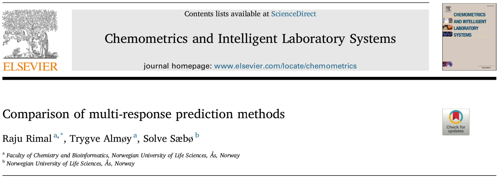

```{r setup, include=FALSE}
## Knitr Options
options(htmltools.dir.version = FALSE, digits = 3, signif = 999)
## Chunk Options
knitr::opts_chunk$set(
  echo = FALSE, comment = NULL, eval = TRUE,
  dev = 'svg', out.width='100%', fig.retina=2,
  fig.align = 'center', warning = FALSE,
  message = FALSE)
## Hightlight part of code hook
hook_source <- knitr::knit_hooks$get('source')
knitr::knit_hooks$set(source = function(x, options) {
  x <- stringr::str_replace(x, "^[[:blank:]]?([^*].+?)[[:blank:]]*#<<[[:blank:]]*$", "*\\1")
  hook_source(x, options)
})
## Source the script file for creating relevant space
source("_script/00-function.R")
source("_script/relevant-space.R")
load("_script/design.rdata")
pred_error <- readRDS("_script/prediction-error.rds")
est_error <- readRDS("_script/estimation-error.rds")
## Load packages
library(tidyverse)
library(simrel)
library(gridExtra)
library(pls)
library(ggridges)
```

class: center, middle, inverse

# A comparison of multi-response prediction methods

## Raju Rimal, Trygve Almøy and Solve Sæbø

### 19 June, 2019

```{r, out.width='40%'}
knitr::include_graphics("_images/NMBUwhite.svg")
```

[`https://therimalaya.github.io/SSC16`](https://therimalaya.github.io/SSC16)

---
exclude: true

background-image: url(_images/logo-nb.svg), url(_images/SSC16-Logo.svg)
background-size: 35% auto, 25% auto
background-position: 25% 50%, 75% 50%
background-repeat: no-repeat

---

class: top, linear-model

.left-column[
# Linear Model
## Relevant and Irrelevant Space

].right-column[
.pull-left[

```{r, out.width='100%', dev='svg', fig.asp=0.6, fig.align='center', fig.width=5, eval = TRUE}
col_vec <- rev(RColorBrewer::brewer.pal(3, "Set1"))
rel_col <- alpha(col_vec[2], 1)
irrel_col <- alpha(col_vec[1], 0.2)
plt <- plot_model(rel_col, irrel_col, 1, 0.6)
grid.newpage()
grid.draw(grid_by_name(plt,"rect_box|labels|arrow_ann"))
```


```{r simulation-1}
set.seed(777)
sobj <- simrel(
  n      = 20,
  p      = 10,
  q      = 10,
  relpos = list(1:4),
  R2     = 0.8,
  gamma  = 0.9,
  ypos   = list(1:4),
  m      = 4,
  type   = "multivariate"
)
```


```{r, fig.width = 4, dev= 'svg', fig.asp = 1, fig.align='left', out.width = '100%'}
plot_cov(sobj, type = "relpred", ordering = FALSE, facetting = FALSE) +
  guides(fill = guide_legend(
    label = FALSE, title = element_blank(), override.aes = list(
      fill = "white", color = "white"
    )
  ))
```

].pull-right[

```{r, out.width='100%', dev='svg', fig.asp=0.6, fig.align='center', fig.width=5, eval = TRUE}
col_vec <- rev(RColorBrewer::brewer.pal(3, "Set1"))
rel_col <- alpha(col_vec[2], 1)
irrel_col <- alpha(col_vec[1], 0.2)
plt <- plot_model(rel_col, irrel_col, 1, 0.6)
grid.newpage()
grid.draw(grid_by_name(plt,"rect_box|yrel_space|xrel_space|labels|in_labels|arrow_ann"))
```

```{r, fig.width = 4, dev= 'svg', fig.asp = 1, fig.align='left', out.width = '100%'}
plot_cov(sobj, type = "relpos", ordering = FALSE, facetting = FALSE)
```

]
]

---
class: top, methods

.left-column[
# Methods
### PCR
### PLS1
### PLS2
### Xenv
### Senv

].right-column[

## Principal Component Regression (PCR)

## Partial Least Squares
### Modeling individual response separately (PLS1)
### Modeling all responses together (PLS2)

## Envelopes
### Envelopes in Predictor Space (Xenv)
### Simulteneous Envelopes (Senv)

]


---
class: top, simulation

```{r cov-plot-prep}
selected_designs <- design %>%
  mutate(Design = row_number()) %>%
  filter(Design %in% c(1, 9))
sobj_list <- lapply(1:nrow(selected_designs), function(i){
  set.seed(2019)
  selected_designs %>% select(-Design) %>% get_design(i) %>% simulate()
})
names(sobj_list) <- paste0("Design", selected_designs$Design)
sigma_zy_pop <- map_df(sobj_list, function(obj){
  obj %>%
    cov_mat(which = "zy", use_population = TRUE) %>%
    tidy_sigma() %>%
    abs_sigma()
}, .id = "Design")
sigma_zy_samp <- map_df(sobj_list, function(obj){
  obj %>%
    cov_mat(which = "zy", use_population = FALSE) %>%
    tidy_sigma() %>%
    abs_sigma()
}, .id = "Design")
sigma_zy <- bind_rows(
  Population = sigma_zy_pop,
  Sample = sigma_zy_samp,
  .id = "Type"
)
lambda_df <- bind_rows(
  Population = map_df(sobj_list, tidy_lambda, use_population = TRUE, .id = "Design"),
  Sample = map_df(sobj_list, tidy_lambda, use_population = FALSE, .id = "Design"),
  .id = "Type"
)
design_chr_selected <- selected_designs %>%
    select(relpos, gamma, Design) %>%
    modify_at("relpos", paste0) %>%
    mutate_at("relpos", ~gsub("list\\(c\\((.+)\\))", "\\1", ..1))
design_name <- paste0("Design", selected_designs$Design)
design_lbl <- with(design_chr_selected, {
  paste(design_name, map2_chr(relpos, gamma, paste, sep = " | "), sep = "\n")
})
names(design_lbl) <- design_name
```

.pull-left[
# Simulation

```{r cov-plot-pop, fig.width=6, fig.asp=1}
lbl <- sapply(opts[c("n", "R2")], unique)
lbl <- paste(names(lbl), lbl, sep = ": ", collapse = ", ")
sigma_zy %>% 
  filter(Type == "Population") %>% 
  ggplot(aes(Predictor, Covariance, color = factor(Response))) +
  geom_bar(data = lambda_df %>% filter(Type == "Population"), 
           aes(x = Predictor, y = lambda),
           fill = "lightgrey",
           stat = "identity", inherit.aes = FALSE) +
  geom_point(size = rel(0.8)) +
  geom_line(size = rel(0.5)) +
  facet_grid(rows = vars(Design), cols = vars(Type),
             labeller = labeller(Design = design_lbl )) +
  theme(legend.position = "bottom") +
  labs(x = "Components",
       y = "Absolute Covariances",
       color = "Response Variable",
       title = "Covariance between Predictor Components and Responses",
       subtitle = "High/Low Multicollinearity with near/far relevant predictors") +
  scale_color_brewer(palette = "Set1") +
  annotate(geom = "text", label = lbl, x = Inf, y = Inf, hjust = 1, 
           vjust = 2, family = "mono", size = rel(5))
```

].pull-right[
# Experimental Design

```{r design-plot}
design_chr %>%
  mutate(Design = row_number()) %>%
  ggplot(aes(p, rev(gamma), color = Design %in% c(1, 9))) +
  geom_point(shape=4, show.legend = FALSE) +
  ggrepel::geom_text_repel(
    aes(label = formatC(Design, flag = "0", digits = 1, format = "fg")),
    nudge_x = 0.03, family = 'mono', fontface = "bold", size = rel(5),
    show.legend = FALSE) +
  facet_grid(eta ~ relpos, labeller=label_both) +
  theme_minimal(base_size = 16, base_family = "mono") +
  theme(panel.grid.minor = element_blank(), text = element_text(face = "bold")) +
  scale_x_continuous(breaks = unique(design_chr$p)) +
  scale_y_continuous(breaks = unique(design_chr$gamma)) +
  labs(x = "Number of Predictors (p)",
       y = "Level of Multicollinearity (eta)") +
  coord_equal(ratio = 200) +
  scale_color_manual(values = 1:2)
```

]

---
class: top, simulation

.pull-left[
# Simulation

```{r cov-plot-samp, fig.width=6, fig.asp=1}
lbl <- sapply(opts[c("n", "R2")], unique)
lbl <- paste(names(lbl), lbl, sep = ": ", collapse = ", ")
sigma_zy %>% 
  filter(Type == "Sample") %>% 
  ggplot(aes(Predictor, Covariance, color = factor(Response))) +
  geom_bar(data = lambda_df %>% filter(Type == "Sample"), 
           aes(x = Predictor, y = lambda),
           fill = "lightgrey",
           stat = "identity", inherit.aes = FALSE) +
  geom_point(size = rel(0.8)) +
  geom_line(size = rel(0.5)) +
  facet_grid(rows = vars(Design), cols = vars(Type),
             labeller = labeller(Design = design_lbl )) +
  theme(legend.position = "bottom") +
  labs(x = "Components",
       y = "Absolute Covariances",
       color = "Response Variable",
       title = "Covariance between Predictor Components and Responses",
       subtitle = "High/Low Multicollinearity with near/far relevant predictors") +
  scale_color_brewer(palette = "Set1") +
  annotate(geom = "text", label = lbl, x = Inf, y = Inf, hjust = 1, 
           vjust = 2, family = "mono", size = rel(5))
```

].pull-right[
# Experimental Design

```{r design-plot}
```

]

---
class: top, data

```{r pred}
pred_dta <- design_chr %>%
  select_if(function(x) n_distinct(x) > 1) %>%
  mutate(Design = as.character(1:n())) %>%
  mutate_at(vars(p, gamma, relpos, eta), as.factor) %>%
  right_join(pred_error, by = "Design") %>%
  mutate_if(is.character, as.factor) %>%
  mutate_at("p", as.factor) %>%
  mutate(Response = paste0("Y", Response))
min_comp_stk <- pred_dta %>%
  group_by(p, relpos, eta, gamma, Method, Tuning_Param, Response) %>%
  summarize(Pred_Error = mean(Pred_Error)) %>%
  group_by(p, relpos, eta, gamma, Method, Response) %>%
  summarize(Tuning_Param = Tuning_Param[which.min(Pred_Error)])
pred_min <- pred_dta %>%
  select(-Design, -q) %>%
  semi_join(min_comp_stk, by = c(
    "p", "relpos", "eta", "gamma", "Method",
    "Tuning_Param", "Response"
  )) %>% select(-Tuning_Param) %>%
  spread(Response, Pred_Error)
comp_min_pred <- pred_dta %>%
  group_by(p, relpos, eta, gamma, Method, Replication, Response) %>%
  summarize(Tuning_Param = Tuning_Param[which.min(Pred_Error)]) %>%
  spread(Response, Tuning_Param)
```

```{r pred-mdl}
pred_mdl <- lm(
  formula = cbind(Y1, Y2, Y3, Y4) ~ (p + gamma + eta + relpos + Method) ^ 3,
  data = pred_min)
comp_mdl_pred <- lm(
  formula = cbind(Y1, Y2, Y3, Y4) ~ (p + gamma + eta + relpos + Method) ^ 3,
  data = comp_min_pred)
pred_aov <- anova(pred_mdl) %>%
  as_tibble(rownames = "Factors")
comp_aov_pred <- anova(comp_mdl_pred) %>%
  as_tibble(rownames = "Factors")
aov_df_pred <- bind_rows(list(Pred = pred_aov, Comp = comp_aov_pred), .id = "Type")
```

# Data for Analysis

.pull-left[

```{r data-design-tbl, fig.asp=1, fig.width=8, out.width="100%"}
source("_script/data-design.R")
data_design_tbl
```


].pull-right[

## Error Model

$$\mathtt{Pred.Error} \sim \left(\mathtt{p} + \mathtt{relpos} + \mathtt{gamma} + \mathtt{eta} + \mathtt{Methods}\right)^3$$
## Component Model
$$\mathtt{Min.Components} \sim \left(\mathtt{p} + \mathtt{relpos} + \mathtt{gamma} + \mathtt{eta} + \mathtt{Methods}\right)^3$$

]

---
class: top

.pull-left[
# Prediction Error

```{r pred-err-eff-1, eval = TRUE}
thm <- theme(plot.title = element_blank(),
             plot.subtitle = element_blank(),
             legend.position = "top")
plt1 <- eff_df("eta:relpos:Method", pred_mdl) %>%
  eff_plot3(reorder = FALSE, labeller = label_both, switch_facet = TRUE) +
  theme_grey(base_family = "mono", base_size = 15) +
  thm +
  labs(x = NULL,
       y = "Min. Prediction Error") +
  scale_y_continuous(labels = function(x) formatC(x, flag = "0", digits = 2, format = "f"))
plt2 <- eff_df("eta:relpos:Method", comp_mdl_pred) %>%
  eff_plot3(reorder = FALSE, labeller = label_both, switch_facet = TRUE) +
  theme_grey(base_family = "mono", base_size = 15) +
  thm +
  theme(legend.position = "none") +
  labs(x = "Methods",
       y = "No. of Components") +
  scale_y_continuous(labels = function(x) formatC(x, flag = "0", digits = 2, format = "f"))
plt <- gridExtra::arrangeGrob(plt1, plt2, ncol = 1)
grid::grid.newpage()
grid::grid.draw(plt)
```


].pull-right[
# Manova

```{r pred-manova-data}
model_labels <- c(
  Comp = "Number of Components",
  Pred = "Prediction Error"
)
plt_data <- aov_df_pred %>%
  filter(!(Factors %in% c('Residuals', '(Intercept)'))) %>%
  select(Model = Type, Factors, Pillai,
         Fvalue = `approx F`, Pvalue = `Pr(>F)`) %>%
  mutate(Model = factor(Model, levels = c("Pred", "Comp"))) %>%
  mutate(Pvalue = ifelse(Pvalue < 0.05, "<0.05", ">=0.05"))

get_manova_plot <- function(plt_data, term = NULL) {
  plt_x_lbl <- plt_data %>% 
    group_by(Factors) %>% 
    summarise(Pillai = mean(Pillai)) %>% 
    arrange(desc(Pillai)) %>% 
    pluck("Factors")
  plt <- plt_data %>%
    ggplot(aes(reorder(Factors, Pillai), Pillai, fill = Pvalue)) +
    geom_bar(stat = "identity") +
    geom_text(aes(label = round(Fvalue, 2)), family = 'mono',
              angle = 0, hjust = "inward", size = 3) +
    facet_grid(cols = vars(Model), scales = 'free_y',
               labeller = labeller(Model = model_labels)) +
    theme_grey(base_family = "mono", base_size = 14) +
    theme(legend.position = c(0.85, 0.1),
          legend.direction = 'verticle',
          axis.text.x = element_text(angle = 90, hjust = 1, vjust = 0.5)) +
    scale_x_discrete(position = "top") +
    guides(fill = guide_legend(title.position = "top",
                               title.hjust = 0.5)) +
    labs(x = NULL, y = "Pillai Statistic") +
    coord_flip()
  if (!is.null(term)) {
    plt <- plt + theme(
      axis.text.y = element_text(
        color = rev(ifelse(grepl(term, plt_x_lbl), "red", "black"))
      )
    )
  }
  return(plt)
}
```


```{r pred-manova-1}
get_manova_plot(plt_data, term = "^relpos$|^Method$|^relpos:Method$|^eta:relpos:Method$")
```

]

---
class: top

.pull-left[
# Prediction Error


```{r pred-err-eff-2, eval = TRUE}
thm <- theme(plot.title = element_blank(),
             plot.subtitle = element_blank(),
             legend.position = "top")
plt1 <- eff_df("relpos:gamma:Method", pred_mdl) %>%
  eff_plot3(reorder = FALSE, labeller = label_both, switch_facet = TRUE) +
  theme_grey(base_family = "mono", base_size = 15) +
  thm +
  labs(x = NULL,
       y = "Min. Prediction Error")
plt2 <- eff_df("relpos:gamma:Method", comp_mdl_pred) %>%
  eff_plot3(reorder = FALSE, labeller = label_both, switch_facet = TRUE) +
  theme_grey(base_family = "mono", base_size = 15) +
  thm +
  theme(legend.position = "none") +
  labs(x = "Methods",
       y = "No. of Components") +
  scale_y_continuous(labels = function(x) formatC(x, flag = "0", digits = 2, format = "f"))
plt <- gridExtra::arrangeGrob(plt1, plt2, ncol = 1)
grid::grid.newpage()
grid::grid.draw(plt)
```

].pull-right[
# Manova

```{r pred-manova-2}
get_manova_plot(plt_data, term = "^gamma$|^Method$|^gamma:Method$|^gamma:relpos:Method$")
```

]

---
class: top, acknowledgment
exclude: true

.pull-left[
# Acknowledgement

.card[
```{r, out.width='100%'}
knitr::include_graphics('_images/solve.jpg')
```
.card-text[
## Solve Sæbø
### NMBU
]
].card[
```{r, out.width='100%'}
knitr::include_graphics('_images/trygve.jpg')
```
.card-text[
## Trygve Almøy
### NMBU
]
]

]
.pull-right.biostat-logo[


]

---

class: top, reference

# References

.left-column[
[R-package: `simrel`](https://cran.r-project.org/web/packages/simrel/index.html)

```{r}
knitr::include_graphics("_images/simrel-hex.svg")
```

]

.right-column[
[Comparison of multi-response prediction methods. In: _Chemometrics and Intelligent Laboratory Systems_ DOI: `https://doi.org/10.1016/j.chemolab.2019.05.004`](https://www.sciencedirect.com/science/article/pii/S016974391930187X)

```{r}

```

]

---
exclude: true

background-image: url(_images/Thank-You.svg)
background-size: cover
background-position: center
background-repeat: no-repeat

